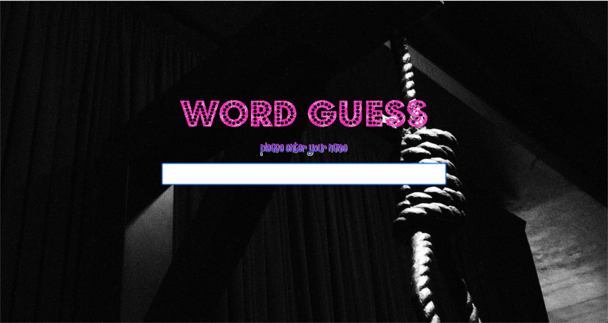
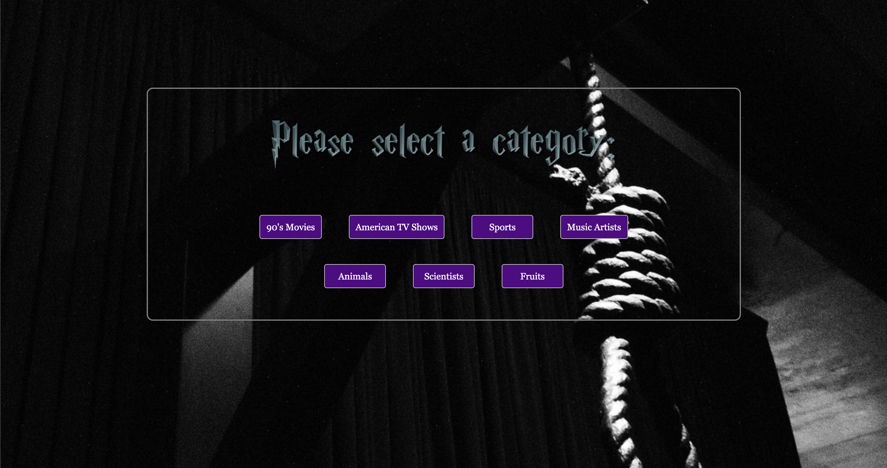
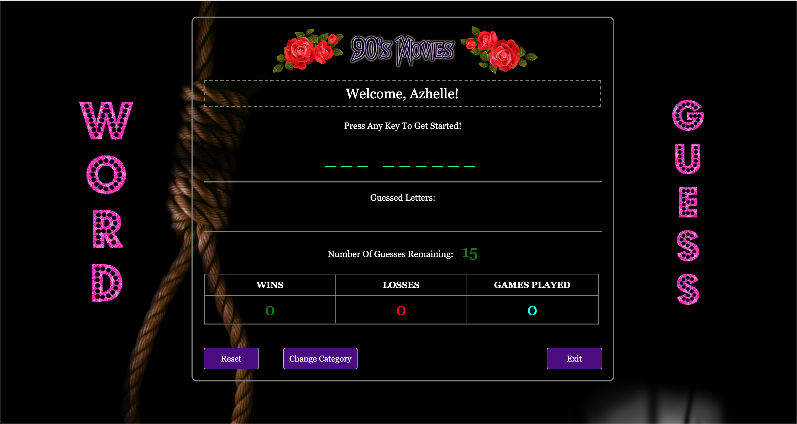

# Word Guess

## Description

An application based on the Hangman Game.

### How Does It Work?

Like the Hangman game, the player's objective is to guess the word before the number to guess runs out.

The player can choose among seven categories: 

<b>_90's Movies, American TV Shows, Sports, Music Artists, Scientists, Fruits and Animals._</b>

###Screenshots:

1. Home Page

2. Available Categories

3. Game Proper

### Special Credits:

_https://www.flamingtext.com_ - for the logo images

_https://www.clipartmax.com_ - for the rose logo

_Wikipedia, IMDB, Rolling Stone, Billboard, Good Housekeeping_ - list of words to be guessed

_https://www.orangefreesounds.com_ - for the sounds used for this game
